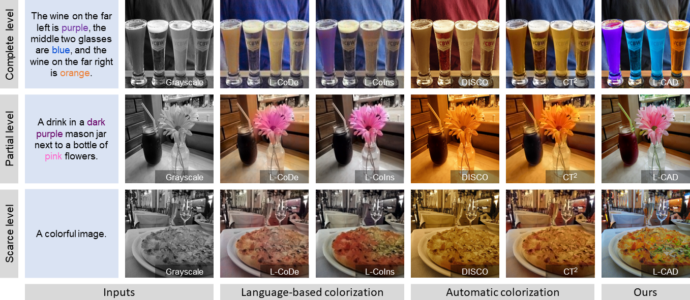

# L-CAD: Language-based Colorization with Any-level Descriptions using Diffusion Priors

**Abstract**: Language-based colorization produces plausible and visually pleasing colors under the guidance of user-friendly natural language descriptions. In this paper, we propose L-CAD to perform language-based colorization with any level descriptions. Additionally, we showcase its capability for efficient automatic colorization.




## Prerequisites
* Python 3.9
* PyTorch 1.12
* NVIDIA GPU + CUDA cuDNN

## Installation
Clone this repo: 
```
https://github.com/changzheng123/L-CAD.git
```
Install PyTorch and dependencies
```
http://pytorch.org
```
Install other python requirements
```
pip install -r requirement.txt
```

## Test with pre-trained model

Download pre-trained models here [(baidu)](https://pan.baidu.com/s/18mAbnjjGaj5nXuG4JiutQg?pwd=778j ) [(google)](https://drive.google.com/drive/folders/1lkQIPYJN3T8TDC4kyt4mQ2_awBv6hMMO?usp=sharing) and put them into "./models", and run:

```
python colorization_main.py 
```

Run demo with instance-aware sampling:

```
python inference.py
```

## Train

##### Download dataset:

[Extended COCO-Stuff](https://github.com/changzheng123/L-CoDe)  provides additional correspondence annotations between color words and object words. 

[Multi-instance](https://drive.google.com/file/d/1FnVdKtAVdgIm8AXT3jZTivNySILUErU9/view) contains samples with distinctive visual characteristics and detailed language descriptions for multiple instances in images.

##### Download init_model:

Download init_model from [(baidu)](https://pan.baidu.com/s/1JBsfiCKKURHWi_k5LH9szg?pwd=151n ) [(google)](https://drive.google.com/drive/folders/1lkQIPYJN3T8TDC4kyt4mQ2_awBv6hMMO?usp=sharing) and put it into "./models".

##### Run the command:

```
python colorization_main.py -t
```


## License

Licensed under a [Creative Commons Attribution-NonCommercial 4.0 International](https://creativecommons.org/licenses/by-nc/4.0/).

Except where otherwise noted, this content is published under a [CC BY-NC](https://creativecommons.org/licenses/by-nc/4.0/) license, which means that you can copy, remix, transform and build upon the content as long as you do not use the material for commercial purposes and give appropriate credit and provide a link to the license.

## Citation
If you use this code for your research, please cite our papers [L-CAD: Language-based Colorization with Any-level Descriptions using Diffusion Priors](https://ci.idm.pku.edu.cn/Weng_NeurIPS23.pdf)
```
@InProceedings{lcad,
  author = {Chang, Zheng and Weng, Shuchen and Zhang, Peixuan and Li, Yu and Li, Si and Shi, Boxin},
  title = {L-CAD: Language-based Colorization with Any-level Descriptions using Diffusion Priors},
  booktitle = {{NeurIPS}},
  year = {2023}
}
```
## Other language-based colorization
L-CoDe: Language-based colorization using color-object decoupled conditions [(AAAI22)](https://ci.idm.pku.edu.cn/Weng_AAAI22.pdf)

L-CoDer: Language-based colorization with color-object decoupling transformer [(ECCV22)](https://ci.idm.pku.edu.cn/Weng_ECCV22g.pdf)

L-CoIns: Language-based colorization with instance awareness [(CVPR23)](https://ci.idm.pku.edu.cn/Weng_CVPR23f.pdf)
